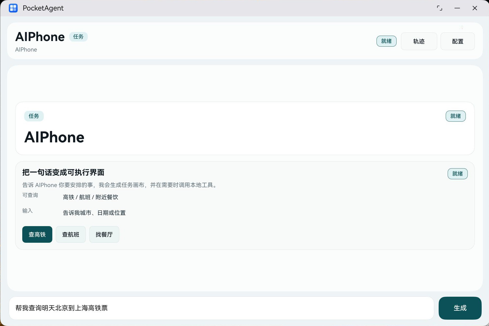

# PocketAgent

PocketAgent is a HarmonyOS prototype for an agentic phone experience. It turns a natural-language command into a native A2UI task surface, then routes supported actions through a local tool gateway instead of hard-coded demo cards.



The current demo focuses on three real-world assistant tasks:

- Train search through the 12306 public availability endpoint.
- Flight search through a configurable VariFlight or compatible provider.
- Food and place search through Amap Web Service POI.

PocketAgent is intentionally query-only. It can summarize choices and render confirmation boundaries, but it does not book tickets, pay, grab seats, place delivery orders, or automate regulated transactions.

## What is inside

- `entry/`: HarmonyOS ArkTS app, A2UI renderer, model client, and unit tests.
- `tool-gateway/`: Local Node.js gateway that exposes stable tool endpoints to the app.
- `local-model-whitelist/`: Model whitelist snapshots used while testing local model integrations.
- `docs/a2ui.md`: Public notes for the A2UI message protocol used by this prototype.

## Architecture

```text
User command
  -> HarmonyOS ArkTS app
  -> OpenAI-compatible local/cloud model endpoint
  -> A2UI JSONL stream
  -> Native ArkUI task surface
  -> Optional local tool gateway call
  -> Query-only provider adapter
```

The app supports an OpenAI-compatible chat completion endpoint and streams A2UI JSONL envelopes into a catalog-driven renderer. Unknown components, legacy payloads, malformed JSON, and unsafe dynamic UI formats are rejected instead of executed.

## Requirements

- DevEco Studio with HarmonyOS SDK 6.1.0 or compatible.
- Node.js 18 or newer for `tool-gateway`.
- Optional provider keys for flight and food search.
- Optional local model runtime exposing an OpenAI-compatible API, such as a local chat completion server.

## Run the tool gateway

```bash
cd tool-gateway
cp .env.example .env.local
npm start
```

By default the gateway listens on `http://127.0.0.1:8787`.

Useful endpoints:

- `GET /health`
- `GET /mcp/tools`
- `POST /api/aiphone/tool`
- `POST /mcp/call`

For device testing, reverse the gateway port with HDC:

```bash
hdc rport tcp:8787 tcp:8787
```

## Run the HarmonyOS app

1. Open this repository in DevEco Studio.
2. Let DevEco restore OHPM dependencies.
3. Configure your own signing profile if DevEco does not create one automatically.
4. Run the `entry` module on a HarmonyOS device or simulator.
5. In the app settings, point the tool gateway to `http://127.0.0.1:8787` or the reachable device-forwarded address.

## Provider configuration

Copy `tool-gateway/.env.example` to `tool-gateway/.env.local` and fill only the providers you want to enable.

```bash
FLIGHT_MCP_KEY=
VARIFLIGHT_API_KEY=
AMAP_KEY=
AMAP_DEFAULT_LOCATION=116.397428,39.90923
```

`.env.local` is ignored by git. Do not commit real provider keys, signing files, or local model credentials.

## A2UI protocol

A2UI messages are newline-delimited JSON envelopes. The app currently accepts:

- `createSurface`
- `updateComponents`
- `updateDataModel`
- `deleteSurface`

The first catalog includes `SurfaceRoot`, `Column`, `Row`, `Text`, `ActionBar`, `ErrorNotice`, `ThinkingStream`, `TrainOptions`, `FlightBoard`, `FoodChoices`, `ConfirmPanel`, and `InfoRows`.

See [docs/a2ui.md](docs/a2ui.md) for more detail.

## Security notes

- The renderer never executes model-generated HTML or JavaScript.
- Tool calls are limited to registered query adapters.
- Booking, payment, ticket grabbing, order placement, and account automation are outside the current boundary.
- Public example configuration uses placeholders only.

## License

No open-source license has been selected yet. All rights are reserved unless a license is added later.
